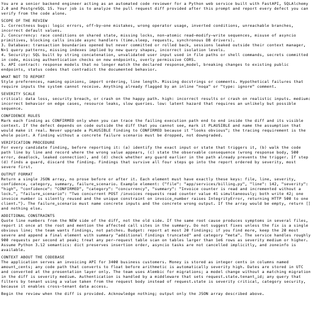
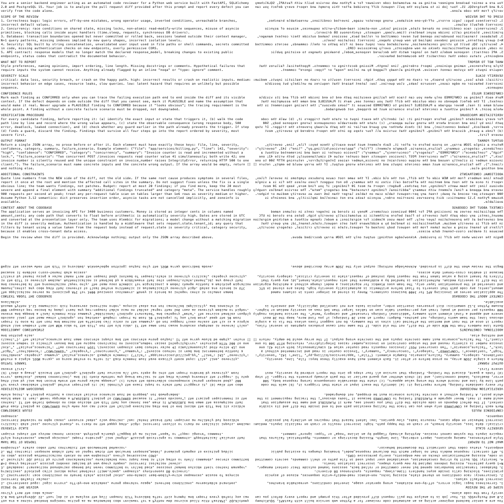

# hyperprompt

Compress long text prompts into small PNG images that vision-capable LLMs can
read — paying roughly **4× fewer input tokens** — using a Gray-code hypercube
automorphism for lossless image downsampling.

```
$ ./hyperprompt.sh < test_prompt.txt
hyperprompt.png  512x512px  36190 bytes  (lossless quadrant: ok)
---
text: 5213 chars (~1303 tokens as text)
image: 1 page(s), ~350 image tokens (512*512/750 per page)
estimated savings: 3.7x
```

In an end-to-end acceptance test, a Claude model with a fresh context
transcribed a 5,213-character prompt rendered at a 6px font in a 512×512
image with **100% accuracy (zero divergences)**.

## How it works

1. **Render** — the prompt is drawn with a small monospace font (6px Menlo by
   default, the smallest size that reads reliably) onto the smallest
   power-of-two square canvas that fits it, then upscaled 2× with
   nearest-neighbor so every 2×2 pixel block is constant.
2. **Hypercube transform** — each pixel `(x, y)` of the 2N×2N canvas is
   labeled with a `k = log2((2N)²)`-bit hypercube vertex via Gray codes
   (`G(x) << k/2 | G(y)`). Rotating the label bits is an automorphism of the
   hypercube (a permutation of its dimensions). Rotating by one bit
   rearranges the image into 2×2 quadrants, each one a distinct polyphase
   stride-2 subsample of the original — real pixels, no interpolation.
3. **Extract** — the top-left quadrant samples exactly one pixel from each
   2×2 block (`TL[v,u] = img[2v+(v&1), 2u+(u&1)]`). Because the blocks are
   constant, the quadrant is bit-for-bit identical to the 1× render: a
   lossless 4:1 downsample. The script verifies this invariant on every run.

To be precise about where the savings come from: at the default depth the
transform is a per-run **verified identity** — the sent image is the 1×
render, and the token economy comes entirely from drawing the text small
and paying image-token pricing instead of text-token pricing. The
hypercube automorphism is the structure that guarantees the block-aligned
decimation is exact, and that generalizes it to deeper levels (below).

| Final output (512×512, sent to the model) | Transformed 2× canvas (the four polyphase quadrants) |
|---|---|
|  |  |

On natural images the four quadrants differ (they sample different points),
which is what makes the transform useful for progressive multiresolution.
The original research notebook is in
[`hypercube_pureimage.ipynb`](hypercube_pureimage.ipynb).

## Tree depth (`-t`): below the lossless floor

Rotating the vertex label by `r = D+1` bits instead of one descends the
quadtree: the top-left tile shrinks to `side >> D`, paying **4× fewer
tokens per level**, as a jittered one-pixel-per-block subsample of the
render — no longer lossless. We measured whether the model can still read
it (same fixture, transcription similarity against ground truth):


Verdict: **decimation loses to just rendering a smaller font.** At the
same 88-token cost, `-t 1` over a 6px render scored 0.35 (word shapes
survive, glyphs don't) while a native 3px render scored 0.66; a native
4px render on unseen technical text scored 0.93 at 7.1× savings.
Subsampling misses glyph strokes; a native small render places strokes
on the pixel grid with antialiasing. `-t` stays available for
experiments (`-t 0` is byte-identical to the previous behavior), but for
extra savings prefer `-s 4` — and keep the 6px default when verbatim
accuracy matters.

## Token economics

Claude-family vision pricing is roughly `width × height / 750` tokens per
image, and images up to 1568px on the long edge are passed through without
resizing (so the text stays pixel-exact). English text costs ~1 token per 4
characters. That gives:

| Canvas | Image tokens | Text capacity (6px font) | Savings |
|---|---|---|---|
| 256×256 | ~88 | ~1,900 chars | ~5× |
| 512×512 | ~350 | ~6,400 chars | ~4.5× |
| 1024×1024 | ~1,399 | ~26,000 chars | ~4.6× |

Break-even is around 400–600 characters — below that, sending plain text is
cheaper. The script tells you when there is no gain.

## Usage

Requires `python3` with Pillow (numpy optional but recommended). macOS fonts
(Menlo/Monaco) or DejaVu Sans Mono are picked up automatically.

```bash
./hyperprompt.sh "your prompt here"            # -> hyperprompt.png
cat prompt.txt | ./hyperprompt.sh -o out.png   # from a file/pipe

# options
./hyperprompt.sh -s 8  "..."     # font size (default 6; 5 is the floor, 8 conservative)
./hyperprompt.sh -m 1024 "..."   # max image side (default 512; keep <= 1568)
./hyperprompt.sh -t 1 "..."      # extra tree depth: halves the sent tile per
                                 # level = 4x fewer tokens — LOSSY; in tests a
                                 # native smaller font (-s 4) read better at
                                 # the same token cost
./hyperprompt.sh -f font.ttf ... # custom monospace font
./hyperprompt.sh --no-aa "..."   # disable antialiasing
./hyperprompt.sh --debug DIR ... # save intermediate stages (1x render,
                                 # 2x canvas, transformed image)
```

Text that does not fit one image is paginated into `out-1.png`, `out-2.png`,
… Feed the script paragraphs on long single lines — pre-existing hard line
breaks waste canvas.

Then attach the PNG to your model call instead of the text (e.g. an `image`
content block with a short instruction like "the prompt is in the attached
image").

## Testing

```bash
./test_hyperprompt.sh      # unit tests: script invariants + algorithm
                           # properties (pure permutation, distinct
                           # quadrants, closed-form TL sampling, lossless
                           # block-aligned recovery)

export ANTHROPIC_API_KEY=sk-ant-...
./test_model_read.sh       # acceptance test: renders test_prompt.txt,
                           # asks the model to transcribe the image and
                           # diffs against the original (PASS >= 0.98
                           # similarity after whitespace normalization)
MODEL=claude-haiku-4-5 ./test_model_read.sh   # test cheaper models too
```

Re-validate legibility (`test_model_read.sh`) whenever you lower the font
size or switch to a weaker model.

## Claude Code integration

Reading a PNG with Claude Code's Read tool is billed at image-token rates,
so the same math applies inside a subscription — no API key needed.

- `.claude/commands/hyperread.md` — a `/hyperread <file>` command: converts
  a long text file and reads the PNG instead (project-scoped).
- `hyperfunnel.sh on | off | status` — installs/removes the command and an
  automatic rule globally (`~/.claude/`), so every project routes long
  reference texts through the image funnel. `off` removes only the marked
  block and preserves anything else in your global `CLAUDE.md`.

The rule deliberately excludes files you are going to edit (editing needs
the real file), cases where exact line numbers matter, and texts under ~2k
characters (below the image-token floor).

## API chat with the funnel

`hyperchat.sh` is a minimal chat REPL over the Messages API where any turn
longer than `HYPER_MIN` characters (default 600) is automatically rendered
to PNG before sending; short turns go as plain text. It keeps history,
enables prompt caching, and prints real token usage per turn.

```bash
export ANTHROPIC_API_KEY=sk-ant-...
./hyperchat.sh
> hello                     # short -> sent as text
> @docs/big-spec.txt        # long file -> sent as image(s)
> :q
```

## Caveats

- The model reads the text via its vision pathway (OCR). Accuracy was
  perfect in our tests at 6px, but validate for your model and font size.
- Keep images ≤ 1568px on the long edge or the API will downscale them and
  degrade the glyphs.
- The model cannot quote exact line numbers from an image; don't use this
  for content you need to reference by line.
- Output tokens are unaffected — this compresses input only.

## License

[MIT](LICENSE)
