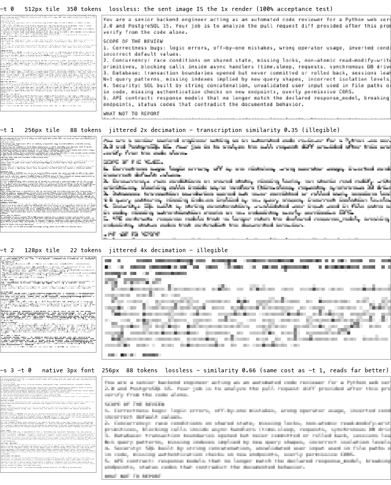

# Tree depth experiment: reading below the lossless floor

**Date:** 2026-07-15, updated 2026-07-16 · **Code:** `-t` and `--fuse`
flags of `hyperprompt.sh`

> **Updated:** see the [follow-up below](#follow-up-grid-snapping-and-a-prior-free-reality-check-2026-07-16)
> — grid snapping (same character = same decimated pattern on every line)
> and a prior-free reality check showing that below-floor prose scores are
> largely context reconstruction.

## Question

One hypercube rotation step splits the 2× canvas into 4 quadrants and the
top-left one is a lossless copy of the 1× render — that is the default
pipeline. Rotating by `r = D+1` steps instead descends the quadtree: the
top-left tile shrinks to `side >> D`, paying **4× fewer tokens per level**,
as a jittered one-pixel-per-block subsample of the render. Can the model
still read it — and if not, can the sibling tiles buy the legibility back?

## Method

Images generated by `hyperprompt.sh`; read in-session by Claude (Fable)
with the Read tool, which bills image tokens exactly like the API
(`side²/750`). For each variant the reader transcribed a fixed passage;
similarity is `difflib.SequenceMatcher` between the transcription and the
best-matching window of the source text, whitespace-normalized. Later
variants use previously unseen texts (macOS man pages) to guard against
recognition bias. **n=1 per variant, one reader — indicative numbers, not
a benchmark.**

## Results

| variant | tile | tokens/page | savings | similarity | verdict |
|---|---|---:|---:|---:|---|
| `-t 0` (default, 6px) | 512×512 | 350 | 3.7× | ≈1.00 | verbatim |
| `-t 1` (6px → 3px effective) | 256×256 | 88 | 14.8× | 0.354 | illegible |
| `-t 1 --fuse` (siblings fused) | 256×256 | 88 | 14.8× | 0.633 | gist readable |
| `-s 7 -t 1 --fuse` (3.5px effective) | 256×256 | 88 | 9.9× | 0.392 | odd font smears |
| `-s 8 -t 1 --fuse` (4px effective) | 256×256 | 88 | 7.7× | **0.904** | near-verbatim |
| `-t 2` (1.5px effective) | 128×128 | 22 | 59.2× | — | illegible |
| `-s 3` native (equal-cost control) | 256×256 | 88 | 14.8× | 0.656 | gist readable |
| `-s 4` native, full page | 512×512 | 350 | 7.1× | **0.928** | near-verbatim |



## Findings

1. **At `-t 0` the transform is a verified identity.** The sent tile is
   bit-identical to the 1× render (checked on every run); the token
   savings come from the small-font render at image-token pricing.
2. **Raw jittered decimation destroys glyphs.** At the same 88-token cost,
   `-t 1` over a 6px render scored 0.35 while a native 3px render scored
   0.66. Word shapes survive; letters don't — the reader's output drifts
   into language-prior hallucination.
3. **Fixing the siblings' mirroring rescues the deep tile.** The four
   siblings of each level carry the same samples with Gray-code
   reflections (TR mirrored in x, BL in y, BR rotated 180°). Orienting
   and averaging them (`--fuse`) is exactly a 2×2 box filter of the
   render — antialiased downsampling at the same one-tile cost. It
   scored 0.63 vs 0.35, parity with the native small font. The identity
   `fused siblings == box filter` is verified on every run.
4. **With `--fuse`, use even font sizes.** The halving must land on
   integer pixels: `-s 8` (4px effective) scored 0.90 at ~7.7×, while
   `-s 7` (3.5px effective) smeared strokes across pixels and collapsed
   to 0.39.

## Operational risk: hallucination at marginal legibility

In one control run the reader scored 0.198 by "reading" the GNU rsync man
page wording from memory — macOS actually ships openrsync, whose text
differs. At marginal legibility the failure mode is not visible noise but
plausible-looking text. Below 6px, validate against ground truth before
trusting a transcription.

## Practical guidance

- Verbatim accuracy → stay on the lossless floor (`-s 6`, the default).
- ~90% fidelity is enough → `-s 4` native (7.1×) or `-s 8 -t 1 --fuse`
  (~7.7×); both scored ≈0.9 on unseen technical text.
- Do not use `-t` without `--fuse` for text, and do not use either in the
  automatic funnel.

## Follow-up: grid snapping and a prior-free reality check (2026-07-16)

**Mechanism (hypothesis by the author, confirmed).** Below the lossless
floor a glyph's decimated pattern depends on its phase relative to the
sampling grid, so line spacing changes how the same character is
recognized. Menlo 7px has a 9px line height (odd): under `--fuse` (2px
box blocks) consecutive lines alternate between two decimated patterns
of the same character — measured directly: 2 distinct patterns across
50 lines, collapsing to 1 when the line advance is snapped to 10. Menlo
8px has a 5px advance (odd), so the phase alternates per column instead.
This — not the non-integer effective size — is the real reason `-s 7`
scored 0.39.

**Fix (implemented).** When `-t` is active the renderer snaps margins,
character advance and line advance up to the sampling period (`2^D` for
`--fuse`, `2^(D+1)` for the raw tile) and draws glyph-by-glyph, so every
occurrence of a character decimates identically. Unit test 7 asserts
identical fused bands across lines. At 6px the natural metrics (4px
advance, 8px line height) were already grid-perfect — one reason the
lossless default reads at 100%.

**Reality check.** On random dictionary words in numbered lines (no
language prior to lean on), 4px-effective fused tiles read at 2–8% word
accuracy (snapped 8%, unsnapped 2% — right direction, tiny n). The ~0.9
similarities on man-page prose are therefore largely context-driven
reconstruction, not glyph OCR. Practical rule: everything below the
lossless floor is gist reading — never trust it with identifiers, URLs
or numbers.

## Reproducing

```bash
./hyperprompt.sh -t 1 -o raw.png < text.txt            # raw jittered tile
./hyperprompt.sh -t 1 --fuse -o fused.png < text.txt   # oriented siblings, averaged
./hyperprompt.sh -s 8 -t 1 --fuse -o sweet.png < text.txt
./test_hyperprompt.sh                                  # includes the box-filter invariant
```
